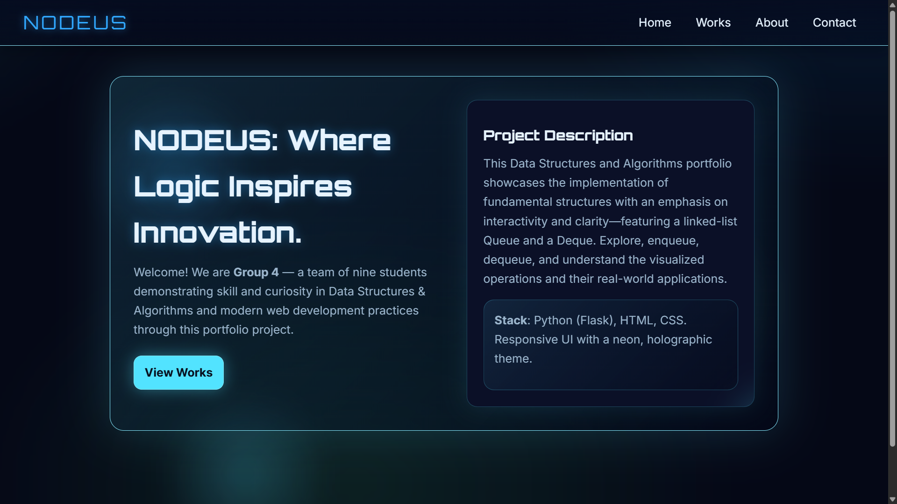
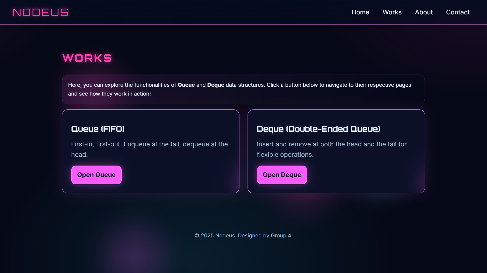
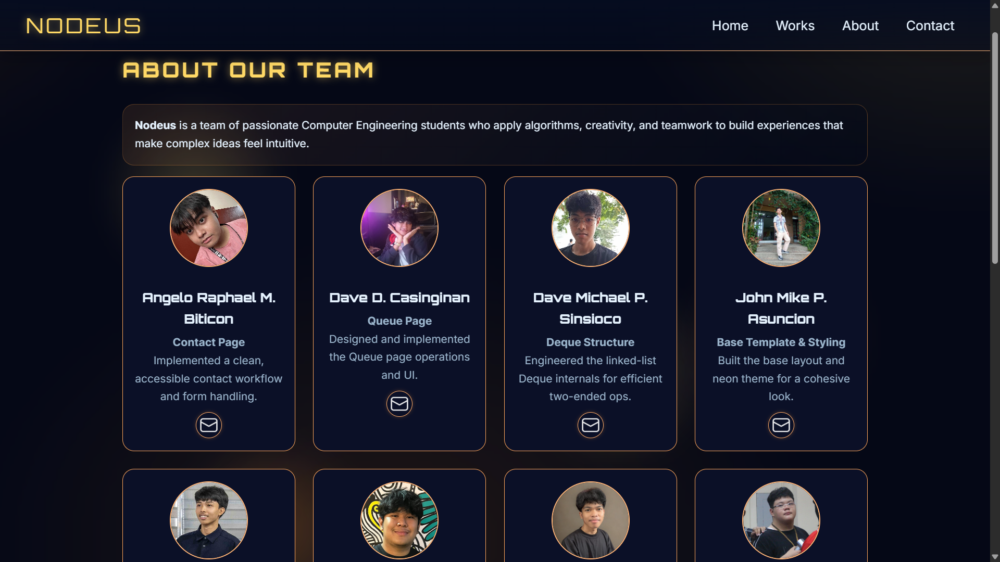
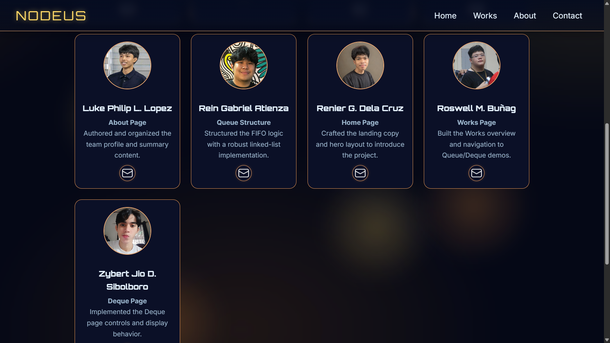
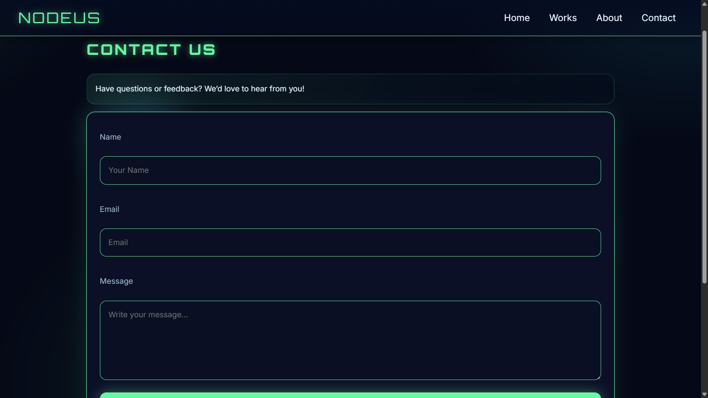
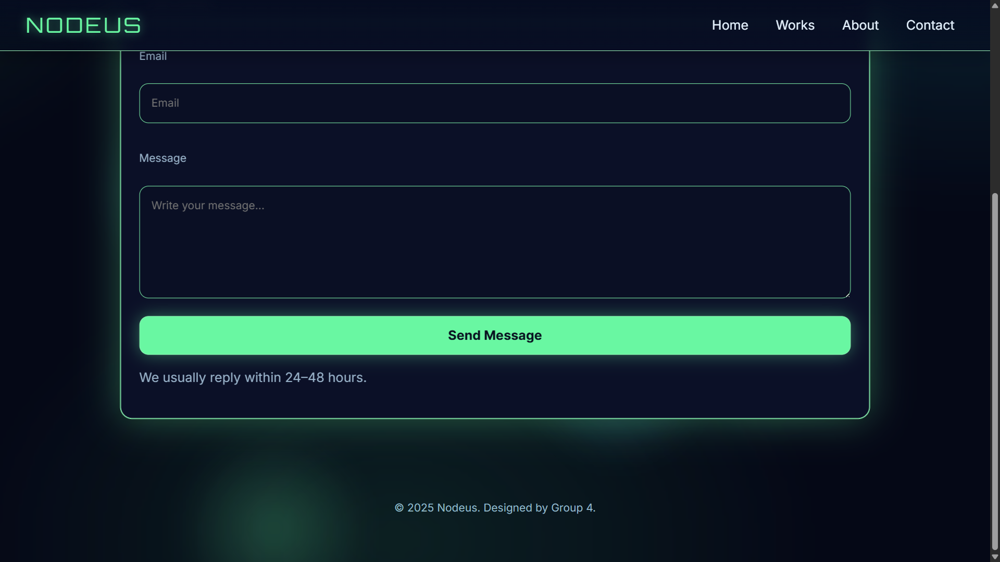
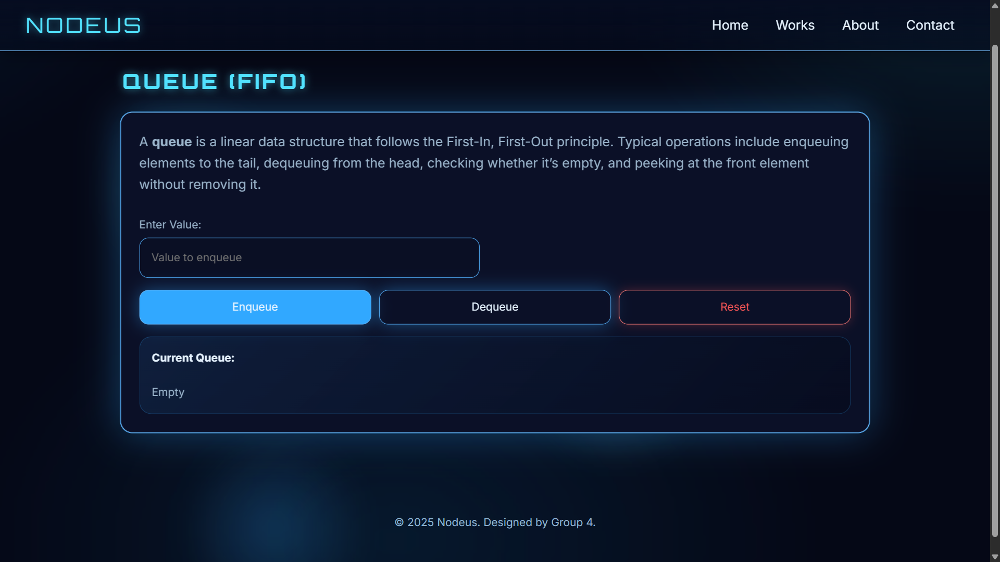
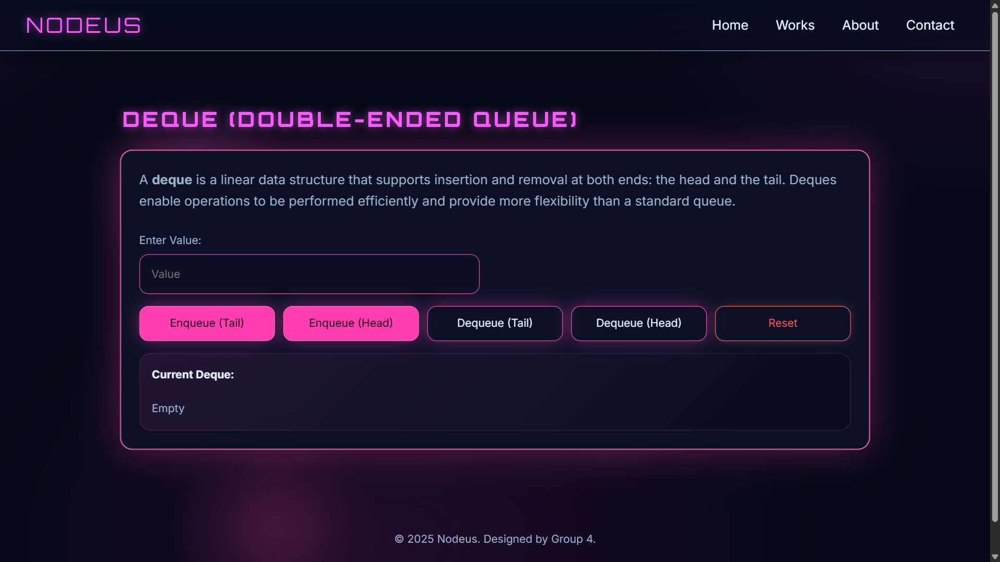

# **DSA Group 4 Lab Exercise 6**

Our web portfolio is a Flask-based website with a futuristic neon and glass look that highlights our group's work in programming and web design. It includes pages like Home, About, Works, and Contact, with special demo pages showing how Queue and Deque data structures work using Linked Lists in Python. Each of the nine team members has their own profile section, and the site is built so we can easily add more projects later. The design is clean, simple, and consistent across all pages, focusing on both functionality and modern style.

## **Directory Structure**

```
DSA_Group4_LabExercise6/
├── static/
│   ├── icons/
│   ├── images/
│   ├── pages/
│   └── style.css
├── templates/
│   ├── about.html
│   ├── base.html
│   ├── contact.html
│   ├── deque.html
│   ├── index.html
│   ├── queue.html
│   └── works.html
├── .gitignore
├── LICENSE
├── README.md
└── app.py
```

## **Pages**

### **Home Page**


### **Works Page**


### **About Page**



### **Contact Page**



## **Works**

### **Queue**


### **Dequeue**


