# **DSA Group 4 Final Requirement**

Our web portfolio is a Flask-based website with a futuristic neon and glass look that highlights our group's work in programming and web design. It includes pages like Home, About, Works, and Contact, plus interactive algorithm demos for data structures and sorting. Each of the nine team members has their own profile section, and the site is built so we can easily add more projects later. The design stays clean and consistent across pages while emphasizing both function and style.

## **Directory Structure**

```
DSA_Group4_LabExercise6/
├─ app.py
├─ README.md
├─ LICENSE
├─ .gitignore
├─ app/
│  ├─ __init__.py
│  ├─ data_structures.py
│  ├─ graph_data.py
│  ├─ routes.py
│  ├─ sorting_routes.py
│  └─ state.py
├─ static/
│  ├─ css/
│  │  ├─ base.css
│  │  ├─ components.css
│  │  ├─ layout.css
│  │  ├─ pages.css
│  │  └─ sorting_style.css
│  ├─ js/
│  │  ├─ base.js
│  │  ├─ graph.js
│  │  ├─ tree_layout.js
│  │  └─ sorting/
│  │     ├─ bubble_sort.js
│  │     ├─ insertion_sort.js
│  │     ├─ merge_sort.js
│  │     ├─ quick_sort.js
│  │     ├─ selection_sort.js
│  │     └─ tabs.js
│  ├─ icons/
│  ├─ images/
│  └─ pages/
└─ templates/
   ├─ about.html
   ├─ base.html
   ├─ bst.html
   ├─ contact.html
   ├─ deque.html
   ├─ graph.html
   ├─ index.html
   ├─ queue.html
   ├─ sorting.html
   ├─ tree.html
   └─ works.html
```

## **Pages**

### **Home Page**
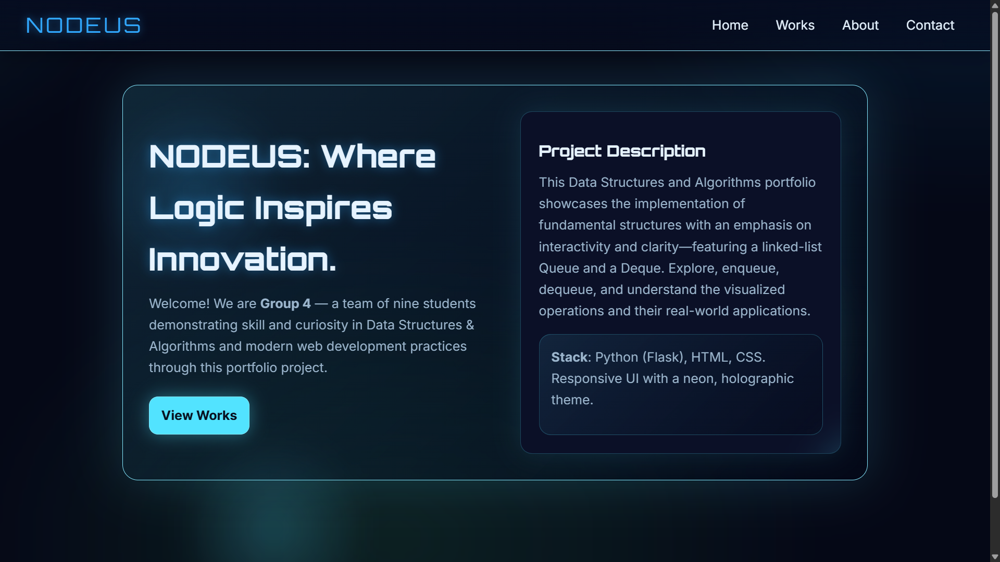

### **Works Page**
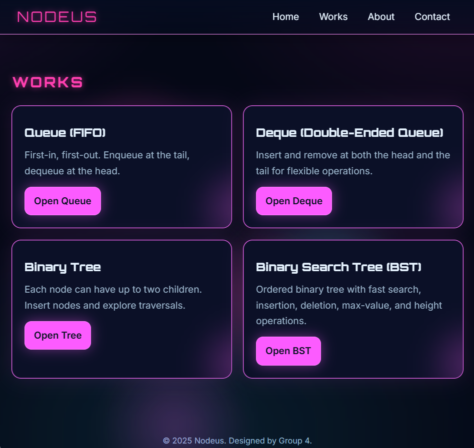

### **About Page**
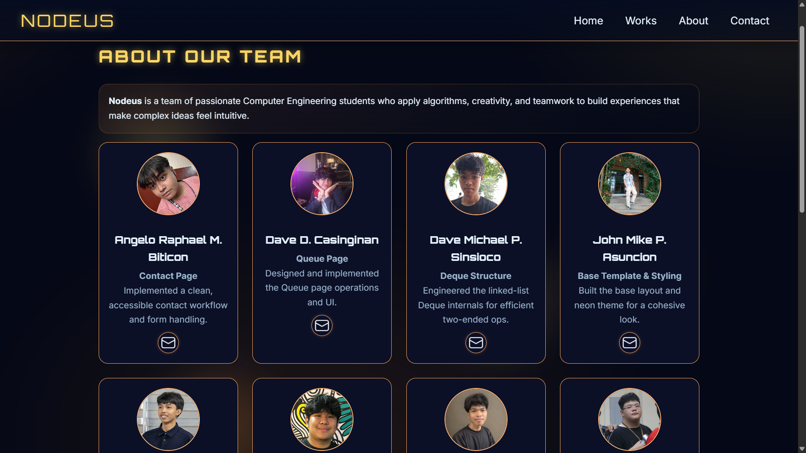
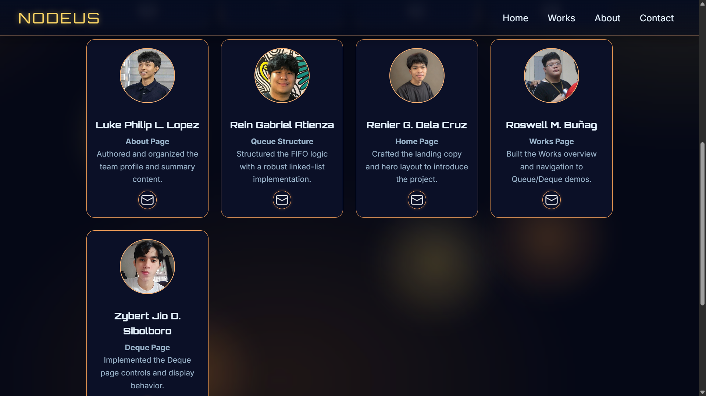

### **Contact Page**
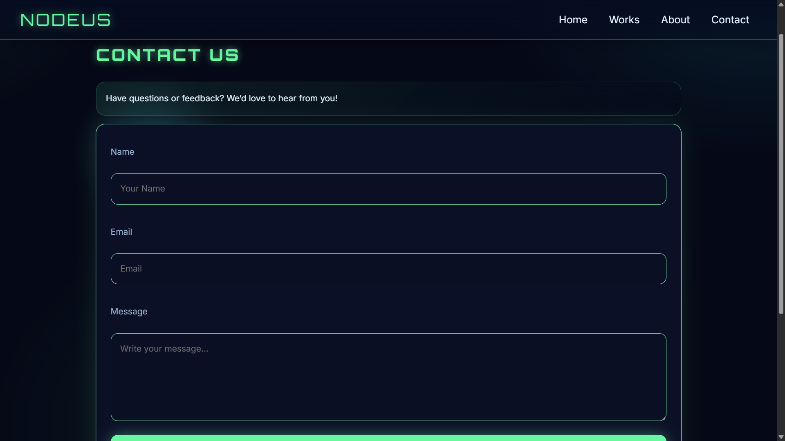
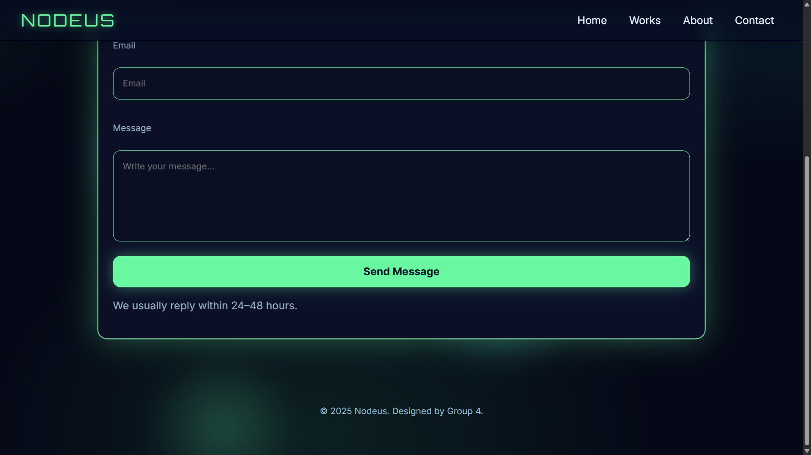

## **Works**

### **Queue**
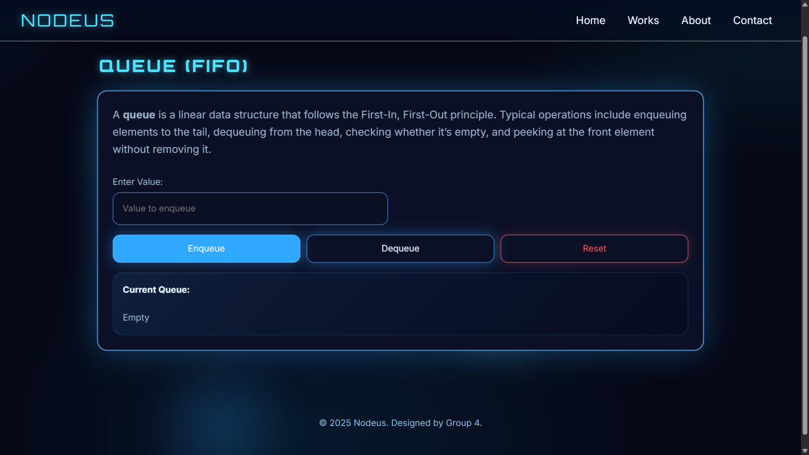

### **Dequeue**
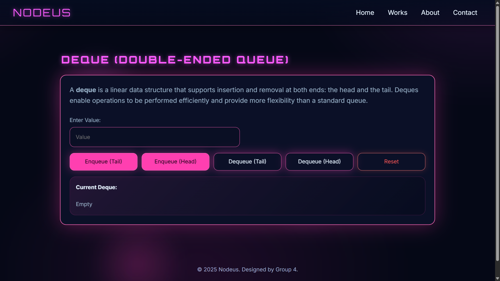

### **Binary Tree**
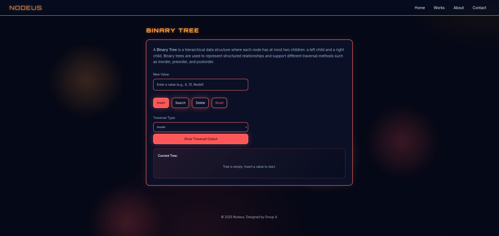

### **Binary Search Tree**
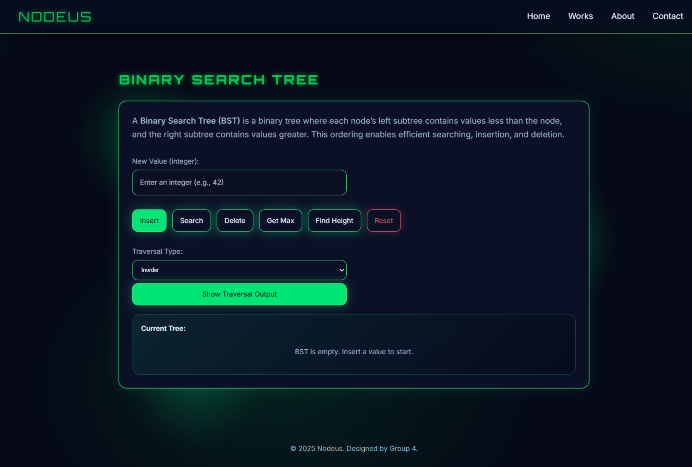

### **Rail Graph**
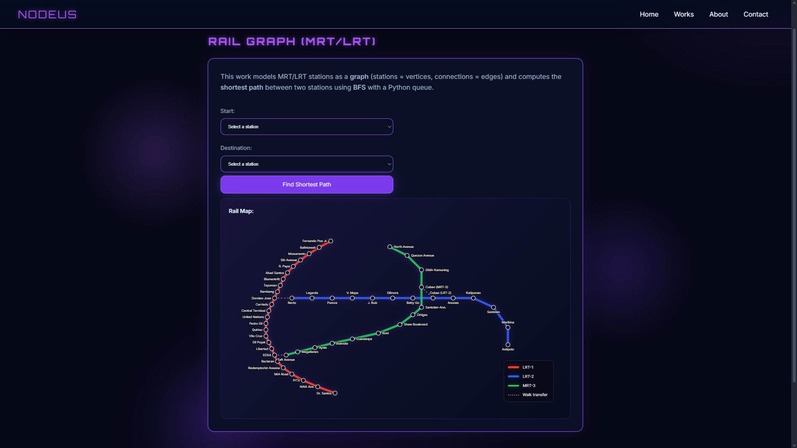

## **Sorting Visualizer**

### **Bubble Sort**


### **Selection Sort**


### **Insertion Sort**


### **Merge Sort**


### **Quick Sort**


